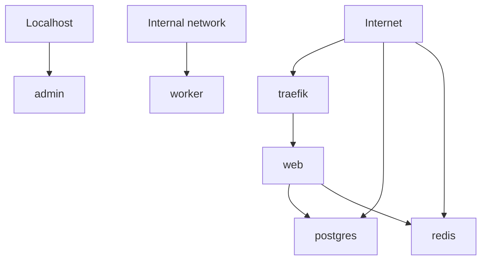

# ExposeMap

Turn your Docker Compose stack into a visual exposure map, so you can quickly see what appears exposed, internal, localhost-only, reverse-proxied, or needs review.

In this README, "appears exposed" means published or mapped by the selected Docker Compose file. It does not mean ExposeMap has proven that a service is reachable from the internet.

ExposeMap runs locally and reads only the Compose file you choose. It does not upload Compose files, reports, service names, labels, secrets, or infrastructure details. It does not connect to containers, change infrastructure, or run live network scans.

Point ExposeMap at a `docker-compose.yml` file and get a Markdown or JSON report you can review before deploying, share during a self-hosted setup review, or run in CI when Compose files change.

```bash
exposemap scan ./docker-compose.yml
```

Example output:

| Service | Likely classification | Why it needs attention |
| --- | --- | --- |
| `traefik` | appears directly exposed | publishes `80:80` and `443:443` |
| `web` | appears reverse-proxied | has Traefik routing labels |
| `postgres` | needs review | publishes `5432:5432` |
| `redis` | needs review | publishes `0.0.0.0:6379:6379` |
| `admin` | localhost-only | binds to `127.0.0.1` |
| `worker` | internal | no published ports |

ExposeMap also generates a Mermaid diagram of likely exposure paths, so a Compose file becomes easier to discuss in issues, pull requests, setup reviews, and team handoffs.

## What ExposeMap Is

ExposeMap is a lightweight, read-only configuration review tool for self-hosters, homelab users, small teams, and developers running Docker Compose on VPS, NAS, home servers, public cloud servers, Tailscale, WireGuard, or reverse proxies.

It parses Docker Compose files, applies simple exposure heuristics, and prints a report showing which services appear internal, localhost-only, directly exposed from Compose configuration, reverse-proxy exposed, or unknown.

## Why ExposeMap Exists

Self-hosted stacks often grow one service at a time: a database here, an admin panel there, a reverse proxy in front, maybe a VPN or tunnel later. After enough changes, it becomes hard to answer a basic question:

Which services appear published, proxied, or internal from this Compose file?

ExposeMap helps make that first-pass map visible from the Compose configuration you already have.

## What It Maps

- Docker Compose services
- Short syntax port mappings such as `80:80`, `5432:5432`, and `127.0.0.1:8080:8080`
- Long syntax Compose ports using `target`, `published`, and `host_ip`
- Localhost-only bindings
- Broad host bindings
- Likely reverse proxy services
- Traefik routing labels and obvious reverse proxy hints
- Risky published database, cache, search, and admin ports
- A Mermaid diagram of likely exposure paths
- Markdown and JSON reports for local review or CI usage

## Who It Is For

- self-hosters
- homelab users
- small teams running Docker Compose
- developers running apps on VPS, NAS, home servers, public cloud servers, Tailscale, WireGuard, or reverse proxies

## What You Get

- A local Markdown report for quick review
- JSON output for automation and CI
- A Mermaid diagram of likely exposure paths
- Findings for broad host bindings, localhost-only bindings, reverse proxy hints, and risky published database/cache/admin ports
- Exit codes for CI with `--fail-on`

## Quick Start

```bash
npm install
npm run build
node dist/cli.js scan ./docker-compose.yml --format markdown
```

When installed as a package, the CLI command is:

```bash
exposemap scan ./docker-compose.yml --format markdown
```

Markdown remains the default output:

```bash
exposemap scan ./docker-compose.yml
```

## JSON Output

Use JSON when you want CI-friendly structured output:

```bash
exposemap scan ./docker-compose.yml --format json
```

The JSON report includes tool metadata, scanned file path, generated timestamp, summary counts, services, exposure map entries, findings, and the Mermaid diagram string.

## Fail-on Thresholds

Use `--fail-on` to make ExposeMap return exit code `1` when findings at or above a chosen severity are present:

```bash
exposemap scan ./docker-compose.yml --fail-on high
exposemap scan ./docker-compose.yml --format json --fail-on medium
```

Supported values:

- `none` - always exit `0` unless CLI usage or parsing fails
- `high` - exit `1` if any high finding exists
- `medium` - exit `1` if any medium or high finding exists
- `low` - exit `1` if any low, medium, or high finding exists

The default is `none` for backward compatibility.

## Exit Codes

- `0` - scan completed and the `--fail-on` threshold was not violated
- `1` - scan completed and the `--fail-on` threshold was violated
- `2` - invalid CLI usage, unsupported options, missing files, or Compose parsing errors

## Run With Docker

```bash
docker build -t exposemap .
docker run --rm -v $(pwd):/scan exposemap scan /scan/docker-compose.yml --format markdown
```

Docker with JSON and CI threshold:

```bash
docker run --rm -v $(pwd):/scan exposemap scan /scan/docker-compose.yml --format json --fail-on high
```

## CI Usage

ExposeMap can run in CI as a lightweight Compose-based exposure review step. It runs locally in the job, does not send `docker-compose.yml` files or reports anywhere, and does not perform real network scans.

See [docs/ci-usage.md](docs/ci-usage.md) for local, Docker, JSON, and `--fail-on` examples.

Example GitHub Actions workflow:

```yaml
name: ExposeMap

on:
  pull_request:
    paths:
      - "**/docker-compose*.yml"
      - "**/compose*.yml"

jobs:
  exposemap:
    runs-on: ubuntu-latest
    steps:
      - uses: actions/checkout@v4
      - uses: actions/setup-node@v4
        with:
          node-version: 22
      - run: npm ci
      - run: npm run build
      - run: node dist/cli.js scan examples/risky-compose.yml --format json --fail-on high
```

The full example is available at [docs/github-actions-example.yml](docs/github-actions-example.yml). The example uses `examples/risky-compose.yml`, so the `--fail-on high` step is expected to fail; replace the path with your own Compose file in real CI.

## Example Report

ExposeMap is most useful when the report makes a risky Compose stack visible at a glance. The example below is generated from a sample stack with a reverse proxy, a web service behind that proxy, database/cache services with published ports, a localhost-only admin service, and an internal worker.

```markdown
# ExposeMap Report

Scanned file: `examples/risky-compose.yml`

Total services: 6

## Exposure Summary

| Service | Likely classification | Ports | Reverse proxy hints |
| --- | --- | --- | --- |
| traefik | appears directly exposed | `80:80`<br>`443:443` | proxy service |
| web | appears reverse-proxy exposed | - | routing labels/env |
| postgres | needs review | `5432:5432` | - |
| redis | needs review | `0.0.0.0:6379:6379` | - |
```

See [examples/report.md](examples/report.md) for a generated sample.

## Mermaid Diagram Example



## FAQ

### Does ExposeMap prove that a service is reachable from the internet?

No. ExposeMap reviews Docker Compose configuration and reports service exposure hints based on what is published or mapped in that file. Firewalls, VPNs, tunnels, DNS, cloud security groups, host rules, and reverse proxies can all change real-world reachability.

### Does ExposeMap upload my Compose file or report?

No. ExposeMap runs locally and does not upload Compose files, generated reports, service names, labels, secrets, or infrastructure details.

### Does ExposeMap inspect secrets or connect to containers?

No. It does not connect to containers, read running container state, inspect secret values, or modify infrastructure.

### Is this a vulnerability scanner?

No. ExposeMap is a first-pass configuration review tool. It helps make likely exposure paths visible, but it does not replace external scanning, firewall review, threat modeling, or a security audit.

### Why use this if I already have Traefik, Caddy, Nginx Proxy Manager, Tailscale, or WireGuard?

Those tools can be part of the setup, but the Compose file can still publish ports directly, bind services broadly, or mix localhost-only and reverse-proxied services in ways that are hard to see. ExposeMap gives you a local map to review before assuming the setup is private.

### What is free?

The CLI, local reports, Docker usage, JSON output, CI usage, and Mermaid diagrams are free and open source.

### What might be paid later?

Future paid options may include setup review, managed reporting, hosted monitoring, or commercial support for teams. These are not required to use the open-source tool.

## Current Limitations

- No real network scanning
- No Kubernetes support
- No Cloudflare Tunnel API integration
- No Tailscale API integration
- No hosted dashboard
- Findings are heuristic checks based on Docker Compose configuration
- Reverse proxy, firewall, VPN, DNS, cloud security group, and host-level rules can change real exposure

ExposeMap does not prove real internet exposure. It does not replace a full security review, external exposure scan, firewall review, or threat model.

## Roadmap

- HTML report output
- Better reverse proxy label support
- Caddy config support
- Nginx Proxy Manager support
- Cloudflare Tunnel hints
- Tailscale checklist
- External scan integration, opt-in only
- Hosted dashboard

## Contributing

Contributions are welcome. Good first areas include parser edge cases, reverse proxy hints, report output, docs, and sanitized Compose examples.

Read [CONTRIBUTING.md](CONTRIBUTING.md) before opening a PR.

## Community

For now, GitHub issues and discussions are the best place to share examples, edge cases, and ideas. Please do not paste private Compose files, secrets, credentials, or sensitive infrastructure details into public issues.

## Future Cloud and Support Options

ExposeMap is free and open source.

The open-source CLI is the core product: local scanning, Markdown reports, JSON output, Docker usage, CI usage, and Mermaid diagrams should remain useful without any paid service.

Future paid options may be explored if there is clear demand from self-hosters, small teams, or companies that want help operating ExposeMap across multiple stacks. Possible options include:

- setup review for Docker Compose, reverse proxy, Tailscale, or WireGuard setups
- managed reporting for multiple Compose stacks
- scheduled checks and exposure diffs
- team reports
- commercial support for private self-hosted deployments

These options are not required for the OSS launch and are not active product promises yet.

## License

ExposeMap is licensed under AGPLv3. See [LICENSE](LICENSE).
