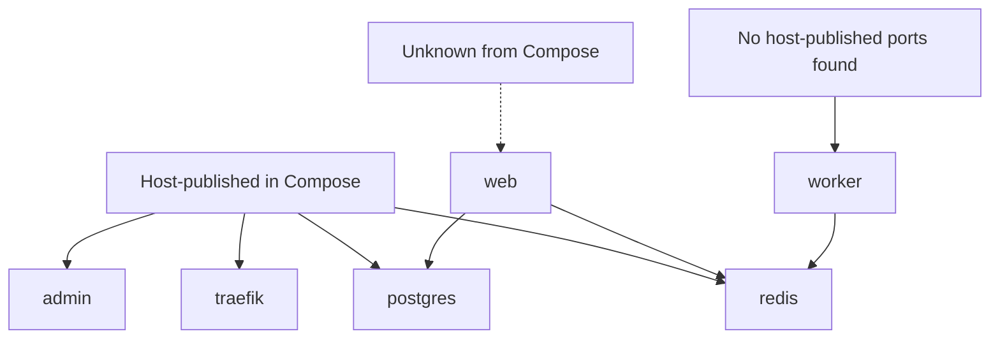

# ExposeMap Report

Scanned file: `examples/risky-compose.yml`

Total services: 6

## Compose Visibility Summary

| Service | Looks like | Why | Notes |
| --- | --- | --- | --- |
| traefik | published | ports: 80:80, ports: 443:443 | - |
| web | unknown | proxy labels detected; note only in MVP | Reverse proxy labels are note only in MVP and are not a formal classification. |
| postgres | published | ports: 5432:5432 | - |
| redis | published | ports: 0.0.0.0:6379:6379 | - |
| admin | published | ports: 127.0.0.1:8080:8080 | Host binding is local, but MVP still reports host-published ports as published. |
| worker | internal | no host-published ports | - |

## Review Notes

### Service exposure is unknown

- Level: medium
- Service: `web`
- Rule: `unknown-exposure`
- Evidence: `proxy labels detected; note only in MVP`
- Recommendation: Review this service manually, including reverse proxy, VPN, firewall, and host-level configuration.

ExposeMap could not confidently classify this service from Compose configuration alone.

### Service appears internal

- Level: low
- Service: `worker`
- Rule: `internal-service`
- Evidence: `no host-published ports`
- Recommendation: Confirm this matches the intended access path and document any proxy, VPN, or firewall assumptions.

No host-published Compose ports were detected. This is not proof that the service is impossible to reach.

## Service Details

### traefik

Looks like: **published**

Why: ports: 80:80, ports: 443:443

Ports:

- `80:80`
- `443:443`

Findings:

No service-specific findings.

### web

Looks like: **unknown**

Why: proxy labels detected; note only in MVP

Ports:

- No Compose `ports` entries detected.

Findings:

### Service exposure is unknown

- Level: medium
- Service: `web`
- Rule: `unknown-exposure`
- Evidence: `proxy labels detected; note only in MVP`
- Recommendation: Review this service manually, including reverse proxy, VPN, firewall, and host-level configuration.

ExposeMap could not confidently classify this service from Compose configuration alone.

### postgres

Looks like: **published**

Why: ports: 5432:5432

Ports:

- `5432:5432`

Findings:

No service-specific findings.

### redis

Looks like: **published**

Why: ports: 0.0.0.0:6379:6379

Ports:

- `0.0.0.0:6379:6379`

Findings:

No service-specific findings.

### admin

Looks like: **published**

Why: ports: 127.0.0.1:8080:8080

Ports:

- `127.0.0.1:8080:8080`

Findings:

No service-specific findings.

### worker

Looks like: **internal**

Why: no host-published ports

Ports:

- No Compose `ports` entries detected.

Findings:

### Service appears internal

- Level: low
- Service: `worker`
- Rule: `internal-service`
- Evidence: `no host-published ports`
- Recommendation: Confirm this matches the intended access path and document any proxy, VPN, or firewall assumptions.

No host-published Compose ports were detected. This is not proof that the service is impossible to reach.

## Mermaid Diagram



## Limitations

- ExposeMap is a lightweight, read-only configuration review tool.
- Results are heuristic checks based on Docker Compose configuration.
- published means host-published in Compose, not internet-reachable.
- internal means no host-published ports found, not impossible to reach.
- ExposeMap does not perform real network scans.
- ExposeMap does not connect to containers or modify Compose files.
- Reverse proxy, firewall, VPN, DNS, cloud security group, and host-level rules can change real exposure.
- Some Compose features, such as profiles, extends, include, anchors, merge keys, or variable interpolation, may require expanded Compose config for safer review.

```text
ExposeMap reads local Compose configuration only.
It does not test live reachability, firewall, DNS, VPN, tunnels, cloud security groups, or vulnerabilities.
Do not paste real Compose files or secrets into public issues. Use sanitized examples only.
Some Compose features, such as profiles, extends, include, anchors, merge keys, or variable interpolation, may require expanded Compose config for safer review.
```
